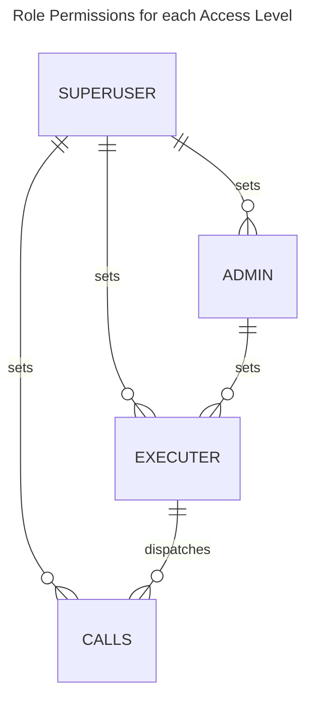

# Design Documentation

## Why are roles distinct and non-overlapping?

RBAC is based on the principle of least privilege, meaning users are only granted permissions necessary for their roles.

The principle of least privilege simplifies the code by separating state handling for each role and reducing the total number of edge cases for role assignment.

## Optimal?

Not in its current state. Simplicity and readability were prioritized.

This prototype aspires to be bug-free and maintainable rather than demonstrate impressive performance.

## Dangerous?

It is dangerous in the wrong hands. If `SuperUser` is centralized or compromised, then they can execute any call from any origin using this pallet.

**It is highly encouraged to assign `SuperUser` to `EnsureRoot`.** This assignment ensures that governance can react to attacks by either revoking access or clearing the allowed calls for the compromised access level.
