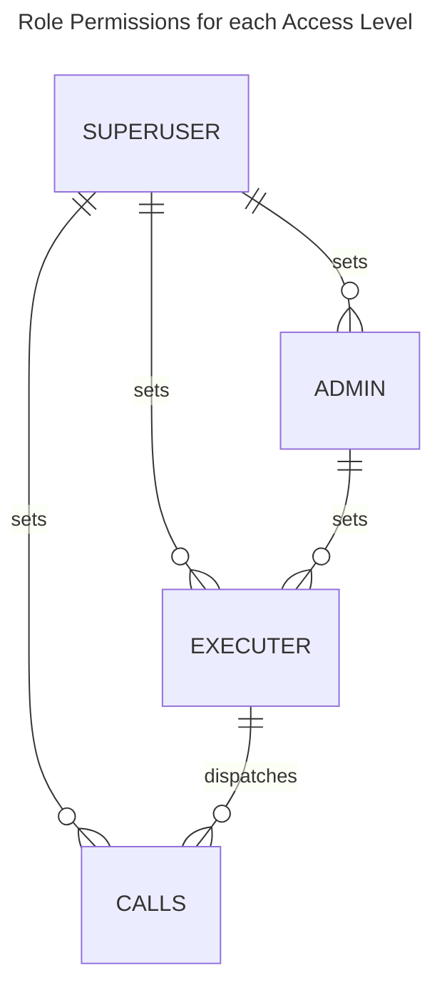

# Call Role-Based Access Control

This pallet implements role-based access control (RBAC) for dispatchable calls. RBAC is an access control model that assigns users and permissions to roles.

Each access level has a unique `RoleId`.

For each access level, there are 2 distinct roles:
1. **Admin**: may add/remove accounts to the `Executor` role for the access level (`grant_access`, `revoke_access`)
2. **Executor**: may execute dispatchable calls allowed for the access level (`execute_call`)

`SuperUser` has 2 main responsibilities:
1. Set calls+origins available for each access level (`set_calls`).
2. Set the Admin(s) for each access level (`grant_access`, `revoke_access`); *Can also set Executor for each access level.*

The `SuperUser` is a configurable [origin](https://docs.substrate.io/build/origins/). It may be set to any governance used by the chain. **It is highly recommended to set `SuperUser` to `EnsureRoot`**.

The [Design Documentation](DESIGN.md) explores the design rationale in greater detail.

## Use Cases

This pallet is useful for managing access to restricted calls. Use cases include:
- coordinating deployment and upgrades for smart contracts
- granting limited trade order functionality to traders for decentralized hedge funds
- delegating governance voting
- delegating stake nominations
- renting out NFTs without ceding ownership

## Usage Instructions

1. Set the calls accessible to the `Executer`s for an access level.

Call `set_calls(roleId: u64, calls: Vec<CallAndOrigin>)` to set the calls (`Vec<CallAndOrigin>`) accessible to accounts that are `Executer`s for the access level (`u64`).

2. Grant access to `Admin`(s) for the access level.

Call `grant_access(roleId: u64, who: AccountId, role: Role::Admin)` using the same `roleId` used in step (1). This must be called by the `SuperUser` origin.

3. Grant access to `Executor`(s) for the access level.

Call `grant_access(roleId: u64, who: AccountId, role: Role::Executor)` using the same `roleId` used in step (1) and (2). This may be called by an `Admin` for the access level or the `SuperUser` origin.

4. Call the restricted call from a permitted account.

Call `execute_call(call: RuntimeCall)`. This must be called by an account that is an `Executor` for a `roleId` with access to the input `call: RuntimeCall`.

`tests/calls::execute_call_works_for_executor_not_admin` demonstrates the flow described above.

## Free Call RBAC

It is often useful to not require users to pay fees for every transaction.

The current implementation may be extended to support RBAC for free/discounted calls. Each `roleId` would require a funded derivative account. This account may be used to store funds for refunding `Executer`s that use `execute_call` to dispatch  its calls. 

Progress tracked in [issue #5](https://github.com/4meta5/pallet-call-rbac/issues/5).

## References
1. [`pallet_utility::dispatch_as`](https://docs.rs/pallet-utility/latest/pallet_utility/pallet/enum.Call.html#variant.dispatch_as) has the same functionality of dispatching the input call from the input origin, but access to this extrinsic is less flexible and less configurable (sender origin must be `EnsureRoot`).
2. [`pallet_lottery`](https://docs.rs/pallet-lottery/23.0.0/pallet_lottery/) uses the `(PalletIndex, CallIndex)` to uniquely identify the call. This representation was used for an initial approach, but was discarded in favor of storing the specific calls.
3. [`pallet_scheduler`](https://docs.rs/pallet-scheduler/24.0.0/pallet_scheduler/) stores the `RuntimeCall` and `PalletsOrigin` in storage and was used as a reference for doing so in this implementation.
4. [`gautamdhameja/substrate_rbac`](https://github.com/gautamdhameja/substrate-rbac/blob/master/src/lib.rs) was identified in early Google search research of existing solutions. It implements a similar system for tracking access control, but does not apply it directly to an on-chain resource (i.e. calls).
